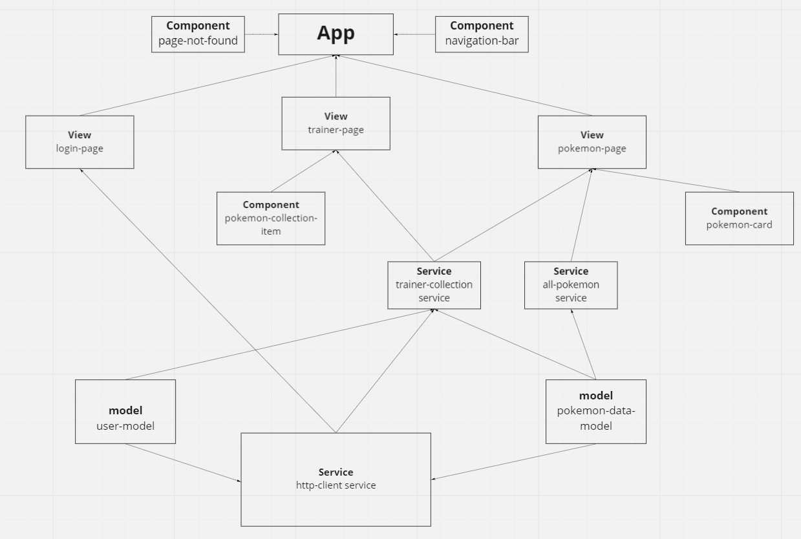

# Pokemon Trainer

Login to your pokémon trainer account and collect from over a thousand of pokémons! View your collected pokémons on your trainer page and remove the ones you dont want.


## Demo

https://pokemon-trainer-assignment-la.herokuapp.com/


## Run Locally

Clone the project

```bash
  git clone https://github.com/mikaellove/pokemon-trainer.git
```

Go to the project directory

```bash
  cd pokemon-trainer
```

Install dependencies

```bash
  npm install
```

Start the server

```bash
  ng serve
```


## Component Tree


## Authors

Love Beling - [@mikaellove](https://github.com/mikaellove)
Andreas Hellström - [@Pizzarulle](https://github.com/Pizzarulle)


